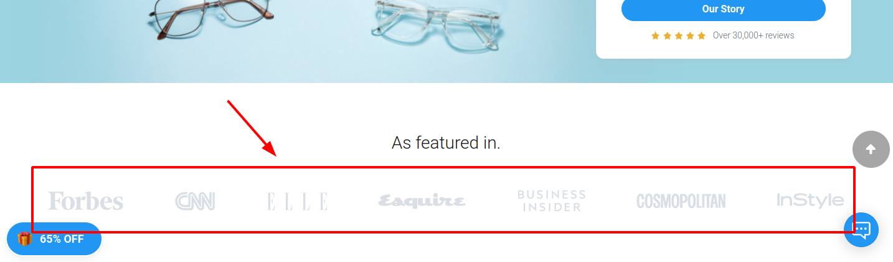
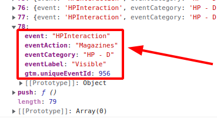
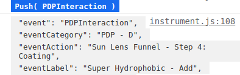
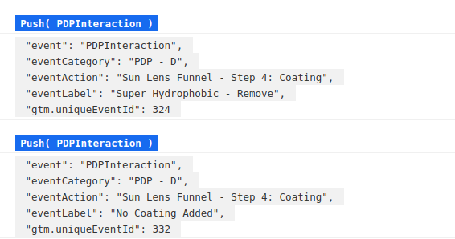
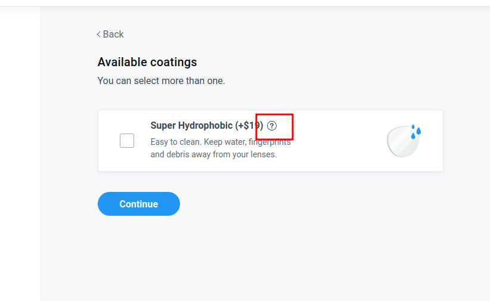

#### Основное задание

1) На домашней странице промотать до блока "As featured in."(1). 
Поймать эвент(2): 
```
{
   "event": "HPInteraction",
   "eventAction": "Magazines",
   "eventCategory": "HP - D",
   "eventLabel": "Visible",
}
``` 
Получить все журналы, проверить что их 7. Прокликать все журналы и поймать на каждый клик эвент(3):
```
{
    "event": "HPInteraction",
    "eventAction": "Magazines",
    "eventCategory": "HP - D",
    "eventLabel": "Click",
}
```
Чтобы проверить что после каждого клика появляется новый эвент, 
перед каждым кликом в тесте стоит очищать dataLayer с помощью - `window.dataLayer = [];`

1  

2  

3 


#### Дополнительное задание
2) Перейти с HomePage на страницу солнцезащитных очков и перейти на страницу любых очков. 
Нажать Select Lenses и пройти до шага 4. Евент срабатывает после нажатия кнопки Continue.



```
{
    name: PDPInteraction
    eventAction: Sun Lens Funnel - Step 4: Coating
    eventCategory: PDP - D
    eventLabel: {{{Super Hydrophobic} - {Add/Remove}}/No Coating Added}
}
```
(Дополнительно) 

Поймать эвенты при добавлении покрытия через PopUp - Learn more



```
{
    "event": "PDPInteraction",
    "eventCategory": "PDP - D",
    "eventAction": "Sun Lens Funnel - Step 4: Coating",
    "eventLabel": "{Learn More - Super Hydrophobic}/{Super Hydrophobic - Add/Remove - PopUp}",
}
```
